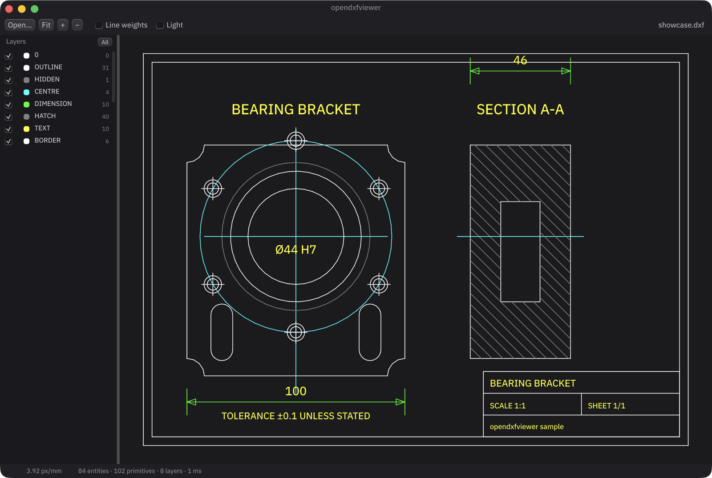

# opendxfviewer

A fast, open source viewer for DXF drawings, written in Rust with
[Makepad](https://makepad.dev).

It opens a DXF file, draws it, and lets you move around it. That is the whole
scope: there is no editing, no conversion, and no CAD kernel. What it aims to do
well is show you what is actually in the file — including the parts most viewers
quietly drop.



## Install and run

```sh
cargo run --release -- drawing.dxf     # or just `cargo run --release`
```

A drawing can also be opened with the **Open…** button, `Cmd`/`Ctrl`+`O`, or by
dropping a `.dxf` file onto the window.

## Using it

| | |
|---|---|
| Pan | drag, or the arrow keys |
| Zoom | scroll wheel or trackpad, at the cursor |
| Zoom to fit | `F`, `Home`, or the **Fit** button |
| Zoom step | `+` / `−` |
| Layers | toggle in the left panel; **All** brings everything back |
| Line weights | toggle in the toolbar to draw the file's stored widths |
| Background | toggle **Light**, which re-resolves colour index 7 |

The status bar shows the cursor position in drawing units, the current scale,
how much of the file was drawn, and anything that could not be.

## What it draws

`LINE`, `CIRCLE`, `ARC`, `ELLIPSE`, `LWPOLYLINE` (with bulges), `POLYLINE`,
`SPLINE` (rational and periodic NURBS, and fit-point-only splines), `POINT`,
`INSERT` including nested, mirrored, non-uniformly scaled and `MINSERT` arrays,
`TEXT`, `MTEXT`, `ATTRIB`, `SOLID`, `TRACE`, `3DFACE`, `LEADER`, `MLINE`,
`RAY`, `XLINE`, and dimensions via their pre-rendered geometry blocks.

Five DXF details are handled once, at load, so the renderer never sees them:

- **Text encoding.** DXF moved to UTF-8 at R2007; older files use the code page
  in `$DWGCODEPAGE`. The `dxf` crate's `load_file` hardcodes Windows-1252, so
  every non-ASCII layer name and text entity in a modern file comes back
  mangled. `read.rs` picks the encoding from the header instead.

- **OCS → WCS.** Planar entities store coordinates in a plane defined by an
  extrusion vector; the arbitrary axis algorithm turns that into a basis. The
  view is an orthographic projection down world Z, so a circle drawn in a plane
  perpendicular to the screen correctly collapses to a line rather than
  silently becoming a circle in the wrong place.
- **Blocks.** `INSERT` references are expanded in place with their full
  transform, guarded against self-reference and unbounded nesting.
- **Colour and layer inheritance.** `ByLayer`, `ByBlock`, and the rule that
  entities drawn on layer `0` inside a block adopt the layer of the `INSERT`
  that placed them. `ByBlock` resolves against the *nearest* enclosing
  reference, not the outermost one — a distinction that is easy to get
  backwards and is pinned by a test.
- **Curves.** Arcs, bulges, ellipses and splines all become polylines, at a
  tolerance relative to each curve's own size.

### Known limitations

- **`HATCH` is not drawn.** The `dxf` crate does not parse it, so the entity
  never reaches us. Hatched regions show their boundary only if the file also
  stores one as a separate entity.
- **Text is drawn upright.** Makepad's text pipeline has no rotation, so
  rotated `TEXT` is placed correctly but not rotated. Its extent is still
  measured, so it participates in zoom-to-fit and culling.
- **`MTEXT` formatting is stripped**, not rendered: line breaks are honoured,
  inline colour, font and stacking codes are removed.
- **Splines with only fit points** are approximated with a centripetal
  Catmull-Rom curve through those points. The authoring program's own
  interpolation is not recorded in the file, so no reader can reproduce it
  exactly; this one at least passes through every fit point.
- **`MLINE` is drawn as its centreline**, since the offsets live in the
  `MLINESTYLE` table.
- Anything else unsupported is **counted and reported in the status bar**
  rather than dropped silently.

## Performance

Measured on an Apple M-series laptop, release build, against a generated
169,229-entity drawing (`python3 tools/gen_fixtures.py --huge`):

| | |
|---|---|
| Parse | 223 ms |
| Convert to a scene | 52 ms |
| Frame, whole drawing on screen | 8.0 ms (530k segments) |
| Frame, zoomed in 4× | 1.9 ms |
| Frame, zoomed in 64× | 21 µs |

Three things make that work:

- **Makepad retains draw lists**, so `draw_walk` runs only on redraw. A view
  nobody is touching costs nothing; the numbers above are what a *change*
  costs, not a steady-state frame.
- **A uniform grid culls by viewport**, so cost tracks what is on screen rather
  than the size of the drawing — which is why zooming in gets cheaper.
- **One instanced quad per segment**, emitted as raw floats into a single draw
  call. The vertex shader builds an oriented quad rather than a bounding box,
  so a long diagonal costs its own area in fragments instead of the square of
  its length.

Peak memory is dominated by the parser, not by the viewer: `dxf` builds about
1.7 KB of `Entity` per entity, so the 169k-entity file peaks near 300 MB during
load. The scene it converts to is 73 MB, most of which is 2.9M `f64` vertices.

Vertices stay `f64` all the way to screen space on purpose. DXF survey drawings
carry coordinates in the millions, where `f32` quantises to centimetres.

## Building

```sh
cargo test            # 128 tests, no GPU needed
cargo clippy --all-targets -- -D warnings
cargo run --release -- tests/fixtures/basic.dxf
```

Linux additionally needs `libx11-dev libxcursor-dev libgl1-mesa-dev
libasound2-dev`.

## Layout

| | |
|---|---|
| `geom.rs` | `f64` vectors, affine transforms, AABBs, segment clipping |
| `read.rs` | choosing a file's text encoding from its header |
| `aci.rs` | the AutoCAD Color Index palette |
| `tessellate.rs` | arcs, bulges, ellipses, NURBS → polylines |
| `convert.rs` | `dxf::Drawing` → `Scene`: OCS, blocks, colours, curves |
| `scene.rs` | the render model |
| `spatial.rs` | uniform-grid view culling |
| `camera.rs` | the world ↔ screen mapping |
| `render.rs` | scene + camera → a batch of screen-space primitives |
| `canvas.rs` | the Makepad widget: shaders, drawing, navigation |
| `layers.rs` | the layer panel |
| `app.rs` | window chrome and file loading |

`render.rs` is deliberately separate from `canvas.rs`: the decisions that govern
how a drawing looks — culling, decimation, line weights, when to re-tessellate a
curve — are then testable without a GPU.

If you are touching the Makepad side, read
[`docs/makepad-notes.md`](docs/makepad-notes.md) first. Several of Makepad 1.0's
rules fail at runtime with no compiler help, and a few fail with no message at
all; that file records the ones this project hit, and what each looks like when
you get it wrong.

### Test fixtures

`tests/fixtures/` holds hand-written ASCII DXF covering the cases that break
readers: bulged polylines, OCS extrusion normals including the `-Z` mirror and
the 1/64 threshold, nested and mirrored and arrayed `INSERT`s, rational and
periodic splines, every text justification, and deliberately degenerate
geometry (zero radii, zero-length lines, empty polylines, coordinates at 1e9).
Regenerate them with `python3 tools/gen_fixtures.py`; add `--all` for the two
large performance fixtures, which are not checked in.

## License

MIT. The AutoCAD Color Index table in `src/aci.rs` is transcribed from
[ezdxf](https://github.com/mozman/ezdxf), also MIT.

DXF is a trademark of Autodesk, Inc. This project is not affiliated with
Autodesk.
